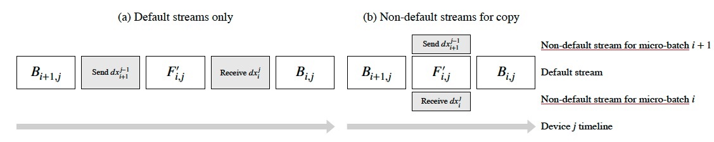
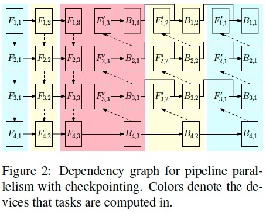

# WarpDrive
a LLM training/inference engine under cluster, CS(Client-Server) environment

## tasks:
1. :building_construction: topology:
	- :white_check_mark: cluster mode
	- :building_construction: CS mode
2. :building_construction: distributed communication (optimize c10d)
	- :white_check_mark: group, subgroup
	- :white_check_mark: fix _store_based_barrier
	- :white_check_mark: P2P comm
	- :white_check_mark: collective comm
	- :building_construction: timeline for cuda stream sync
3. :building_construction: pipeline parallel 
	- :white_check_mark: staged model
	- :white_check_mark: sequence pipeline schedule
	- :stop_sign: 1f1b, interleave schedule
4. :building_construction: activation recomputation
	- :white_check_mark: full mode
	- :stop_sign: selective mode
5. :stop_sign: data parallel
6. :stop_sign: tensor parallel
7. :stop_sign: sequence parallel
8. :white_check_mark: training data (open source)
	- :white_check_mark: OIG
	- :white_check_mark: streaming style dataset, w/o padding
9. :building_construction: models
	- :white_check_mark: Pythia7B
	- :stop_sign: parallel models
10. :building_construction: llm training
	- :white_check_mark: pretrain
	- :stop_sign: RLHF
	- :stop_sign: RLAI
11. :stop_sign: llm evaluation
12. :building_construction: model compression
	- :white_check_mark: empty model init, device map, sequntial loading
	- :white_check_mark: mixed precision training
		- :white_check_mark: fp16 (GPU), loss scale
		- :white_check_mark: bf16 (CPU, GPU), no loss scale
	- :building_construction: quantization
	- :stop_sign: pruning
13. :building_construction: optimizer
	- :building_construction: 8-bit Adam

14. :stop_sign: Adapter
	- :stop_sign: Lora, QLoRa

15. :building_construction: system debug & monitor
	- :building_construction: GPU memory profile
	- :building_construction: comm data sync debug
	- :building_construction: loss convergence

16. :stop_sign: compute graph for distributed computing


## GPUs topology
cluster环境下的均配结构: world_size = pp_size * dp_size * tp_size


```xml
e.g.: 
world_size = 12
pp_size = 3
dp_size = 2
tp_size = 2
pp groups: [[0, 4, 8], [1, 5, 9], [2, 6, 10], [3, 7, 11]]
dp groups: [[0, 2], [1, 3], [4, 6], [5, 7], [8, 10], [9, 11], [12, 14], [13, 15]]
tp groups: [[0, 1], [2, 3], [4, 5], [6, 7], [8, 9], [10, 11]]
```


CS环境下的不均配结构: 按照各stage的GPUs组群

```xml
gpus = [1, 3, 3]
world_size = sum(gpus)
pp_size = len(gpus)
dp_size*tp_size = max(gpus)
ppg: [(0,1,4), (0,2,5), (0,3,6)]
dpg: [(1,2,3), (4,5,6)]
```
## run
1. training
> bash scripts/pretrain_pythia7B.sh


## Concept
1. process group
- main group: 区别pytorch.distributed的default pg, 可以有多个main group
- subgroup: main group可以有多个sub group, pp/dp/tp mode对应不同的subgroup

2. operations
- model forward, backward
- activations recomputing
- communication: p2p, collective comm

通信模式解释


3. schedule
- pipeline schedule: 
	- sequence 
	- 1f1b w/o interleave
	- 1f1b with interleave


- learning rate schedule:


4. mixed precision training: 
	- lower precision: fp32 --> fp16(gpu), bf16(cpu, gpu)
	- scale loss: for fp16
	- quantized optimizer: int8 optimzier states

**mixed precision training**: 


> Mixed precision primarily benefits Tensor Core-enabled architectures (Volta, Turing, Ampere). 
> torch.autocast automatically chooses the precision for GPU operations to improve performance while maintaining accuracy.


5. Quantization
- post-training quantization: weights, buffers
- quantization aware trainging: weights, buffers, actiovations

6. timeline for CUDA streams  
- default stream for computation, non-default stream for communication across ranks
- different streams for each micro batch, and synchronize micro-batches at all-reduce step. Since no relationship btw micro-batches, async is possible.
- parallel recomputing and communication. recompute fw while recv grads from next rank


7. compute graph
- define op function: recompute, communication
- use autograd and CUDA stream to arange ops, micro batches in order


8. system debug & monitor
- torch.profile + tensorboard

## training data
Open source training data
- OIG: https://huggingface.co/datasets/laion/OIG


## models
1. GPTNeoX
- Pythia7B


## todo
- compute graph for staged models: 在pytorch的compute graph的基础上，将跨机器的model之间的通信封装成Function
- sparse transformer
